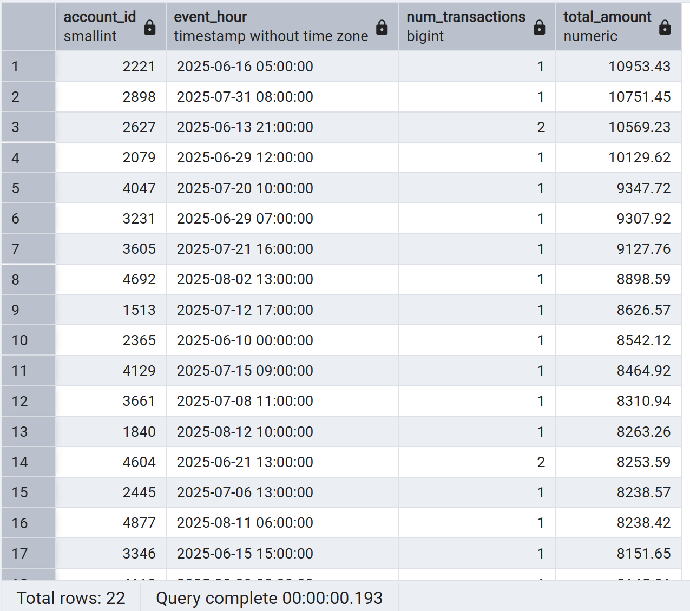

# Transaction Fraud Detection Project
## Part 1: Synthesize Transaction Data
### Step 1: Create empty data tables in PostgreSQL
1. Transaction Table:

```sql
  CREATE TABLE transactions (
  transaction_id VARCHAR(36) PRIMARY KEY,
  account_id SMALLINT,
  transaction_timestamp TIMESTAMP,
  geolocation POINT,
  money_amount FLOAT
  )
```
2. Customer_info Table:
```sql
  CREATE TABLE customer_info (
  account_id SMALLINT PRIMARY KEY,
  customer_name VARCHAR(50),
  residential_loc POINT
  )
```
### Step 2: Generate Synthetic Data using Python Faker Library
1. Import Libraries
```python
  from faker import Faker
  import numpy as np
  import pandas as pd
  
  fake = Faker()
  Faker.seed(42)
  np.random.seed(42)
```
2. Generate Synthetic Customer Data
```python
  customer_dict = {
      "account_id": list(range(1000, 5000)),
      "customer_name": [fake.name() for _ in range(4000)],
      "residential_loc": [fake.latlng() for _ in range(4000)]
  }
  
  customer_df = pd.DataFrame(customer_dict)
  customer_df
```

3. Generate Synthetic Transaction Data
```python
  num_entries = 100_000
  scaling_factor = 50000.0
  min_transaction_amnt = 1.20
  
  transaction_dict = {
      "transaction_id": [fake.uuid4() for _ in range(num_entries)],
      "account_id": np.random.randint(1000, 5000, num_entries),
      "transaction_timestamp": [fake.date_time_between(start_date="-90d", end_date="now") for _ in range(num_entries)],
      # Apply beta distrbution to skew money values towards smaller transaction amounts
      "money_amount": np.random.beta(1, 50, size=num_entries) * scaling_factor + min_transaction_amnt
  }
  
  transaction_df = pd.DataFrame(transaction_dict)
  
  
  ''' Add in partially random geolocation data for detecting Out of Area Logins '''
  
  # Join transaction table w/ customer table
  transaction_df = pd.merge(transaction_df, customer_df, on='account_id', how='left')
  
  # Replace bottom 10000 logs with random geolocation
  tail_transaction_df = transaction_df.tail(10000).copy()
  tail_transaction_df = tail_transaction_df.drop('residential_loc',axis=1)
  tail_transaction_df['geolocation'] =  [fake.latlng() for _ in range(10000)]
  
  transaction_df = transaction_df.rename(columns={'residential_loc': 'geolocation'})
  
  # Union bottom 10,000 logs with upper 90,000 logs and shuffle logs around
  transaction_df = pd.concat([transaction_df.iloc[:90000],tail_transaction_df])
  transaction_df = transaction_df.sample(frac=1).reset_index(drop=True)
  
  # Reformat Table
  transaction_df = transaction_df.drop('customer_name',axis=1)
  transaction_df = transaction_df[['transaction_id', 'account_id', 'transaction_timestamp', 'geolocation', 'money_amount']]
  
  transaction_df
```
## Part 2: Identify Unusual Transaction Activity with SQL
### I. Large Amount of Money Transferred within Short Time Frame
```SQL
  SELECT account_id, 
  DATE_TRUNC('hour', transaction_timestamp) AS event_hour,
  COUNT(*) AS num_transactions,
  ROUND(SUM(money_amount)::numeric,2) AS total_amount
  FROM transactions
  GROUP BY account_id, event_hour
  HAVING SUM(money_amount) > 8000
  ORDER BY total_amount DESC;
```

### II. Sudden Spending Spike (deviation from average transaction amount)
```SQL
  SELECT account_id,
  DATE_TRUNC('day', transaction_timestamp) AS event_date,
  AVG(money_amount) as avg_amount
  FROM transactions
  GROUP BY account_id, event_date
  HAVING AVG(money_amount) > 3 * (SELECT AVG(money_amount)
  								FROM transactions t2
  								WHERE t2.account_id = transactions.account_id)
```
### III. Burst of Transactions in Short Time Frame
```SQL
SELECT account_id, 
DATE_TRUNC('hour', transaction_timestamp) AS event_hour,
COUNT(*) AS num_transactions,
ROUND(SUM(money_amount)::numeric,2) AS total_amount
FROM transactions
GROUP BY account_id, event_hour
ORDER BY num_transactions DESC;
```
### IV. Access from Unexpected Region
```SQL
WITH distance_calc AS (
	SELECT 
	transaction_id,
	t.account_id, 
	transaction_timestamp,
	money_amount,
	-- Haversine formula approximation in kilometers
	6371 * acos(
		LEAST(1, 
			cos(radians(t.geolocation[1])) * cos(radians(c.residential_loc[1])) * 
			cos(radians(c.residential_loc[0]) - radians(t.geolocation[0])) + 
			sin(radians(t.geolocation[1])) * sin(radians(c.residential_loc[1]))
		)
	) AS distance_from_residence_km
	FROM transactions t
	LEFT JOIN customer_info c
	ON t.account_id = c.account_id
)

SELECT *,
CASE
	WHEN distance_from_residence_km > 2000 THEN 'True'
	ELSE 'False'
END AS Out_of_Area
FROM distance_calc;
```
